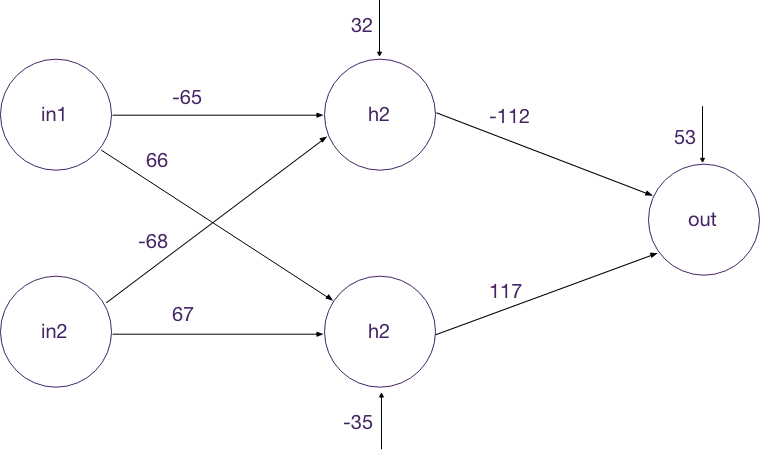

# Introduction-BNNS

Learinig machine leraning on iOS with using Basic Neural Network Subroutines.
Here you can find neural network for count XOR. Full aritcle - [cocoa-beans](http://cocoa-beans.ru/project/ne-coreml-edinym/)

Neural network looks like this:

